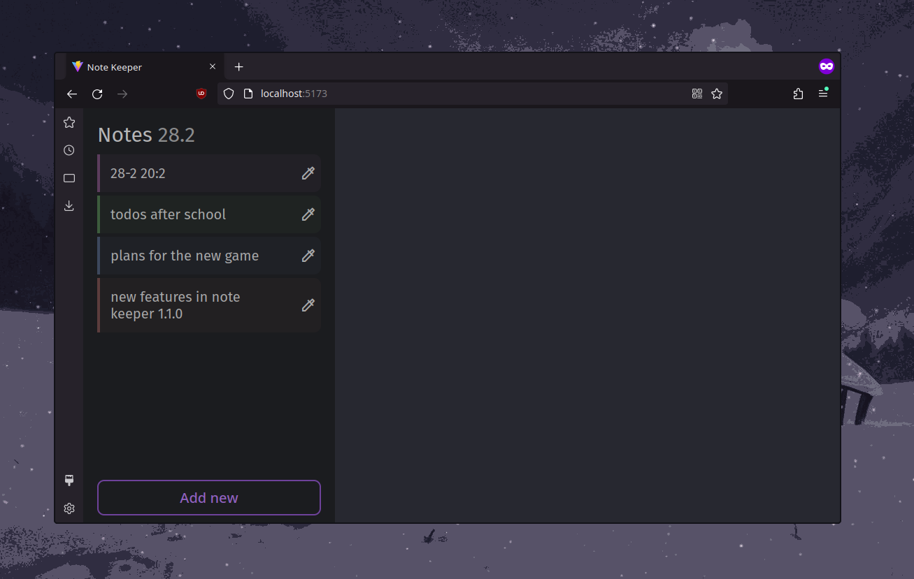

# Note keeper `1.1.1`
- *very simple note keeping apps with groups*
- made for those who need it clean when working with lot of new ideas!

# Features
- really cool ui for adding todos
- grouping system - easily organize yours notes
- the simpliest way to just save notes of today
- no database reseting
- change the colors of each group
- - *it means the default title when making group is the date of today*

## new features in `1.1.0`
- absolutely new ui for the group list and adding note
- fixed some issues on mobile (maybe)